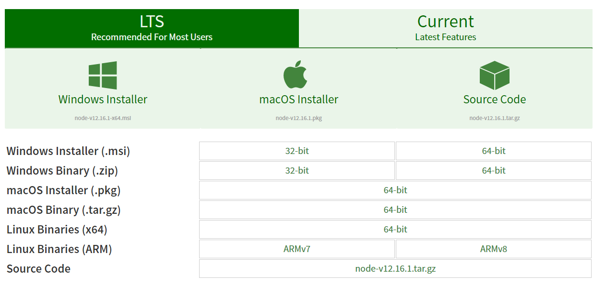
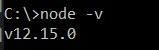
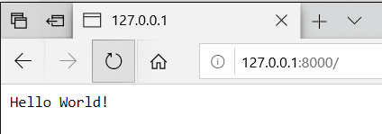

*by:* Mingyu Ma, Siqi Wang


In this blog we will introduce the basic about Node.js and how Node.js's event loop works.

---

# Setup Environment
To set up a node.js environment, you can either download the installer from the node.js website, [**node installer download**](https://nodejs.org/en/). It provides long term support version and the latest version for Windows, MacOS, and Linux.

Another way to do is to install it via package manager. All information can be found on the same website [**node package download**](https://nodejs.org/en/download/package-manager/).



After the installation you also need to setup the environment variables.
 -  For Windows system the default path is `C:\Program Files\nodejs`. To add it to the environment variable you can ran the following command on your command line prompt:
 `SET PATH=C:\Program Files\nodejs;%PATH%`
 And then run `node -v` to check if you had successfully installed Node.js.

     

     This means you had successfully installed Node
 -  For Linux system you can run the following command:
    ```
    #The last part is depend on the version you installed
    export NODE_HOME=/usr/local/node/12.15.0
    export PATH=$NODE_HOME/bin:$PATH
    ```
    Finally run `node -v` to check if you had successfully installed.

 -  For MacOS you can either install by downloading from the website or you can use brew to install, simply run `brew install node` to install Node.js.

# Intro of Node.js

Node.js is a asynchronous event-driven JavaScript runtime. It is designed to build scalable network applications.

Node.js is designated to build a non-blocking environment, it is in contrasts to other concurrency model which employs OS threads more often. Node.js is build entirely around this concept of event loop, which is a asynchronous loop used to handle all incoming requests.

Node does not need any function calls to start its event loop, it simply enters the event loop after it starts executing the input file. Therefore the event loop is kept hidden from the user, and sometimes it is difficult to detect how event loop performs under the hood.

This is an example of a hello world program in NodeJS:
```JavaScript
var http = require('http');

http.createServer(function (request, response) {
  // because this is a HTTP header, you need to specify the response type
  // 200 represent HTTP status OK
  // text/plain specifies the type of response message
  response.writeHead(200, {'Content-Type': 'text/plain'});

  // send Hello World message
  response.end('Hello World!\n');
}).listen(8000);

console.log('Server running at http://127.0.0.1:8000');
```
You can run it with
```
node HelloWorld.js
```
And then you can open any web browser, enter the URL and you will see the hello world message on that web page.



## How Node.js execute Javascript Program?

Node.js is built using the V8 JavaScript engine. V8 is a engine built by Google Chrome development group, the purpose of it is to directly run JavaScript files as users using the web browser.

V8 is a JIT(Just-In-Time) compiler, which means it compiles the program at the run time. It directly transfer the JavaScript code into machine code, which then be executed by the machine. JIT compiler is expected to be faster than traditional compiler, which users have to compile the code first and then runs the executable file generated by the compiler.

Since V8 is built using C++, large portion of Node.js is also built with C++ runtime. Even though it does not affect how a JavaScript program is executed by Node.js, but some of the feature is made available because of C++.

When you start executing a JavaScript server. Node will do several things.
 -  First Node will look at all of the `require()` function and "requires" all of the modules. Because node is asynchronous, it will then check all the events in the program and register the callback function followed that event.
 -  Then Node will enter its Event Loop, using the registered callback functions to respond to incoming client requests.
 -  Depending on the type of request things will be handled differently, and we will talk about that in the next section.

# How Node.js handle requests?

## single-thread

### Event loop

## async

Example crypto

## thread pool

Example http

# Summary
